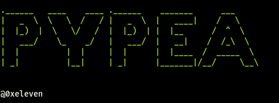

## Python PE Analyzer



Python PE analyzer uses `pefile` library to statically analyze PE binaries, on top of that it also detects if there is a packer present. 

### Usage

First you need to install the `pefile`  library using pip:

```bash
pip install pefile

or

pip install -r requirements.txt
```


```bash
pypea.py [-h] -f FILE [--header] [--sections] [--imports] [--exports] [--signature] [--mz-signature] [--all] [--packer]


options:
  -h, --help            show this help message and exit
  -f FILE, --file FILE  Path to the PE file
  --header              Display standard headers
  --sections            List sections
  --imports             List imported symbols
  --exports             List exported symbols
  --signature           Check digital signature
  --mz-signature        Check MZ (DOS) signature
  --all                 Full dump
  --packer              Detect packer
```

Also II wanted to implement a  de-compiler using `capstone` but failed terribly, that sounds a like a  skill issue on my side which I will rectify soon after I understand how the library works.
